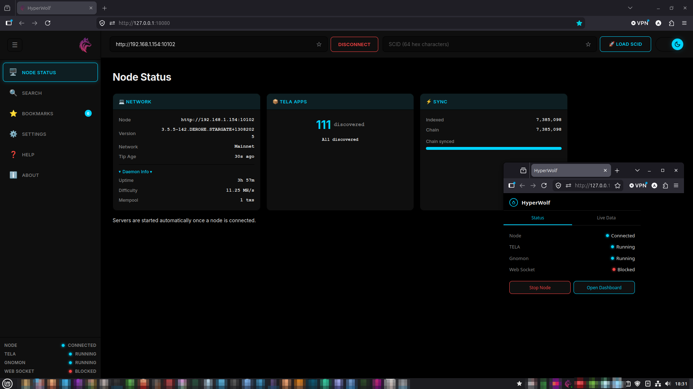

<p align="center">
  
</p>

<h1 align="center">HyperWolf</h1>

<p align="center">
  <strong>Standalone desktop browser for TELA dApps on the DERO blockchain</strong>
</p>

<p align="center">
  <a href="#"></a>
  <a href="LICENSE"></a>
  <a href="#"></a>
  <a href="#"></a>
</p>

<p align="center">
  <b>
    <a href="#features">Features</a> •
    <a href="#screenshots">Screenshots</a> •
    <a href="#quick-start">Quick Start</a> •
    <a href="#usage">Usage</a> •
    <a href="#cli-flags">CLI Flags</a> •
    <a href="#build">Build</a>
  </b>
</p>

---

HyperWolf is a **standalone desktop application** for browsing, searching, and launching **TELA decentralized applications (dApps)** on the **DERO blockchain**. It bundles a local TELA server, a HyperGnomon blockchain indexer, and a real-time dashboard into a **single, zero-dependency binary** — no browser extension or external server required.

---

## Features

| Capability | Description |
|---|---|
| 🌐 **Browse TELA dApps** | Browse and interact with on-chain web apps — HTML, CSS, JS, assets — served as real web pages |
| 🔍 **Search & Discover** | Fuzzy-search the TELA app catalog via the bundled HyperGnomon indexer (Fuse.js frontend) |
| ⚡ **Real-Time Updates** | WebSocket-powered dashboard shows sync progress, new app discoveries, and health status |
| 📡 **Connect Any DERO Node** | Point HyperWolf at any DERO daemon — local or remote — and start browsing |
| 🖥️ **System Tray App** | Runs in the background with a clickable tray icon, connection status LED, and quick controls |
| 📱 **Responsive Dashboard** | Full SPA dashboard embedded in the binary — no external webserver needed |
| 🧩 **DocShard Support** | Loads fragmented/datashard-based TELA apps seamlessly |
| 🚀 **Desktop Integration** | One-command install for Linux XDG, macOS .app bundle, or Windows Start Menu + autostart |
| 📦 **All-in-One Binary** | Go cross-compilation — ship a single file, no browser extension, no runtime |

---

## Screenshots

| Dashboard – Server Status | Search & Discover |
|---|---|
|  |  |

| Bookmarks | Tray Pop-up |
|---|---|
|  |  |

---

## Prerequisites

- **Go 1.26+** (for building from source)
- **A DERO daemon** — local (`127.0.0.1:10102`) or a remote node. The daemon must have the RPC endpoint exposed.
- **~500 MB free RAM** (varies with chain sync state)
- **~2 GB free disk** for the HyperGnomon index database

> 💡 **No daemon handy?** You can run HyperWolf in offline mode to explore the dashboard UI, but syncing and app discovery require a reachable DERO node.

---

## Quick Start

```bash
# 1. Clone and build
git clone https://github.com/ArcaneSphere/HyperWolf
cd HyperWolf
CGO_ENABLED=0 go build -o hyperwolf .

# 2. Launch
./hyperwolf

# 3. Open in your browser
#    → http://127.0.0.1:18080/
```

1. Enter a DERO node address (e.g. `127.0.0.1:10102`) and click **Connect**
2. Wait for the initial HyperGnomon sync (~5 seconds on a local node)
3. Search for TELA apps or paste a SCID directly into the search bar
4. Click an app to load it — it opens as a real web page in your browser

---

## Usage

### Connecting to a Node

HyperWolf can connect to any DERO daemon with the RPC API enabled. The default is `http://127.0.0.1:10102`. You can enter an address with or without the `http://` prefix.

When connected, the system tray icon turns green and the dashboard shows live chain data (height, difficulty, mempool size).

### Searching for TELA Apps

After sync completes, the **Search** page lists all discovered TELA apps with:
- Fuzzy search (powered by Fuse.js) — type any part of the dURL or name
- Sort by rating, name (A-Z / Z-A), or install height (newest / oldest)
- Autocomplete suggestions as you type
- Filtered results (extensions like `.jpg`, `.shards` can be hidden in settings)

### Loading a SCID

Click any search result or paste a full 64-hex SCID into the input field. HyperWolf:
1. Fetches the contract from the DERO chain
2. Serves it via the local TELA proxy (`http://127.0.0.1:18081/tela/{scid}/`)
3. Opens a new browser tab with the live dApp

### Connecting from Another Machine

HyperWolf binds to `127.0.0.1` by default for security. To access the dashboard from another device on your LAN, use an SSH tunnel:

```bash
ssh -L 18080:127.0.0.1:18080 user@hyperwolf-host
```

Then open `http://127.0.0.1:18080/` on your local machine.

---

## CLI Flags

HyperWolf supports several command-line flags for advanced configuration:

| Flag | Default | Description |
|---|---|---|
| `--dashboard-port` | `18080` | HTTP dashboard server port |
| `--tela-port` | `18081` | TELA proxy listen port |
| `--gnomon-api` | `18082` | HyperGnomon API server port |
| `--log-file` | `~/.hyperwolf/hyperwolf.log` | Log file path |
| `--install` | — | Install desktop entries + autostart, then exit |
| `--uninstall` | — | Remove all desktop entries and installed binary, then exit |

### Examples

```bash
# Custom ports
./hyperwolf --dashboard-port 8080 --tela-port 8081 --gnomon-api 8082

# Install as desktop application
./hyperwolf --install

# Uninstall
./hyperwolf --uninstall
```

---

## Configuration

Settings are stored in `~/.hyperwolf/config.json`. This file is created automatically on first run.

```json
{
  "bookmarks": {
    "scids": {
      "a6832a5a...": { "scid": "a6832a5a...", "label": "My App" }
    },
    "nodes": {
      "127.0.0.1:10102": { "node": "127.0.0.1:10102", "label": "Local Node" }
    }
  },
  "settings": {
    "defaultNode": "127.0.0.1:10102",
    "autoConnect": true,
    "directLoad": true,
    "hiddenExtensions": ".jpg,.png,.shards",
    "openDashboardOnStart": true
  },
  "theme": "dark"
}
```

| Field | Type | Default | Description |
|---|---|---|---|
| `settings.defaultNode` | string | `""` | Auto-connect to this node on startup |
| `settings.autoConnect` | bool | `true` | Automatically connect to `defaultNode` at launch |
| `settings.directLoad` | bool | `true` | Open SCIDs in a new browser tab when clicked |
| `settings.hiddenExtensions` | string | `""` | Comma-separated extensions to hide in search results |
| `settings.openDashboardOnStart` | bool | `true` | Open the dashboard URL in your browser on launch |
| `theme` | string | `"dark"` | Dashboard theme (`"dark"` or `"light"`) |

### Data Directories

| Path | Purpose |
|---|---|
| `~/.hyperwolf/config.json` | App settings and bookmarks |
| `~/.hyperwolf/hyperwolf.log` | Application log |
| `~/.hyperwolf/gnomondb/` | HyperGnomon index database |

---

## Architecture

```
┌──────────────────────────────────────────────────────────┐
│                       main.go                            │
│  Parses flags → starts services → runs tray on main      │
└──────┬──────────────┬───────────────┬────────────────────┘
       │              │               │
       ▼              ▼               ▼
┌─────────────┐ ┌───────────┐ ┌──────────────────────────┐
│   state/    │ │  router/  │ │         tray/            │
│  AppState   │ │  Hub+HTTP │ │  SystemTray + Menu        │
│  (sync.RWM) │ │  Server   │ │  (blocks main goroutine)  │
└──────┬──────┘ └─────┬─────┘ └──────────────────────────┘
       │              │
       │         ┌────┴────┬──────────────┐
       ▼         ▼         ▼              ▼
┌───────────┐ ┌───────┐ ┌──────┐ ┌──────────────┐
│  indexer/ │ │daemon/│ │tela/ │ │  desktop/    │
│  SyncMgr  │ │Client │ │Proxy │ │  Install/    │
│ HyperGnom │ │ RPC   │ │Mux   │ │  Uninstall   │
└───────────┘ └──────┘ └──────┘ └──────────────┘
```

**Key subsystems:**

| Package | Role |
|---|---|
| `state/` | Thread-safe application state (connected node, timestamp) |
| `router/` | HTTP server (dashboard API) + WebSocket broadcast hub |
| `indexer/` | HyperGnomon blockchain indexer (sync, discovery, catalog) |
| `tela/` | TELA reverse-proxy manager (per-SCID file serving) |
| `daemon/` | Lightweight DERO daemon JSON-RPC client |
| `desktop/` | Cross-platform desktop integration (install/uninstall) |
| `tray/` | System tray icon with connection status LED |

---

## API Overview

HyperWolf exposes a REST + WebSocket API on the dashboard port. Here are the key endpoints:

| Method | Endpoint | Description |
|---|---|---|
| `POST` | `/api/set_node` | Connect to a DERO node |
| `POST` | `/api/disconnect_node` | Disconnect from the current node |
| `POST` | `/api/server_status` | Full application status (heights, services) |
| `POST` | `/api/load_scid` | Load a SCID via TELA proxy |
| `POST` | `/api/settings` | Save application settings |
| `POST` | `/api/shutdown` | Gracefully stop the application |
| `GET` | `/api/tela/discover` | List all discovered TELA apps |
| `GET` | `/api/config` | Get service ports (gnomon, tela) |
| `GET` | `/ws` | WebSocket endpoint for real-time events |

**WebSocket events:** `sync_progress`, `tip_synced`, `catalog_progress`, `new_tela_app`, `node_unreachable`, `node_recovered`

---

## Build

### Local Build

```bash
CGO_ENABLED=0 go build -o hyperwolf .
```

### Cross-Compilation

```bash
# Linux (amd64)
GOOS=linux   GOARCH=amd64 CGO_ENABLED=0 go build -o hyperwolf-linux .

# macOS (amd64 — Intel)
GOOS=darwin  GOARCH=amd64 CGO_ENABLED=0 go build -o hyperwolf-darwin .

# macOS (arm64 — Apple Silicon)
GOOS=darwin  GOARCH=arm64 CGO_ENABLED=0 go build -o hyperwolf-darwin-arm64 .

# Windows (amd64)
GOOS=windows GOARCH=amd64 CGO_ENABLED=0 go build -o hyperwolf.exe .
```

> 💡 `CGO_ENABLED=0` produces a fully static binary — no external C libraries or system dependencies.

### Web UI tooling

The dashboard lives in `web/` and is embedded into the binary at build time (`//go:embed`). Component work uses the Storybook catalog plus the registry/guardrail scripts:

```bash
npm install              # dev deps only (Storybook + check tooling)
npm run storybook        # component catalog at http://localhost:6006
npm run registry         # regenerate web/ui/registry.json from *.stories.js
npm run check            # guardrails — canonical CSS ownership, refs, registry sync
```

### Tidy Dependencies

```bash
go mod tidy
```

---

## Desktop Installation

HyperWolf can install itself as a first-class desktop application on all three major platforms.

| Platform | `--install` Behavior | Files Created |
|---|---|---|
| **Linux** | Copies binary to `~/.local/bin/`, creates `.desktop` file + autostart entry, installs icon | `~/.local/share/applications/hyperwolf.desktop`<br>`~/.config/autostart/hyperwolf.desktop`<br>`~/.local/share/icons/hyperwolf.png` |
| **macOS** | Creates an `.app` bundle in `~/Applications/`, installs a LaunchAgent for autostart | `~/Applications/HyperWolf.app`<br>`~/Library/LaunchAgents/com.hyperwolf.plist` |
| **Windows** | Copies binary to `%LOCALAPPDATA%\HyperWolf\`, creates Start Menu shortcut, sets registry Run key | `%LOCALAPPDATA%\HyperWolf\hyperwolf.exe`<br>Start Menu shortcut<br>Registry: `HKCU\Software\Microsoft\Windows\CurrentVersion\Run` |

```bash
# Install
./hyperwolf --install

# Uninstall (removes everything above)
./hyperwolf --uninstall
```

---

## Project Status

HyperWolf is in **beta** — actively used but evolving. The core feature set (TELA browsing, search, system tray, desktop integration) is stable.

**Version:** 0.11.0  
**License:** [MIT](LICENSE)  

### Roadmap Ideas

- [ ] Built-in wallet integration (XSWD) for dApp transactions
- [ ] Live terminal view — shows backend log activity in the dashboard
- [ ] Improvement of the system tray functionality
- [ ] RSS integration
- [ ] Bookmark export function across devices
- [ ] Automated bookmarked SCID health/update checks

---

## Contributing

Contributions are welcome! Here's how you can help:

1. **Report bugs** — Open a [GitHub Issue](../../issues) with steps to reproduce
2. **Suggest features** — Start a discussion or open a feature request
3. **Submit PRs** — Fork the repo, make your changes, and open a pull request

Please see [CONTRIBUTING.md](.github/CONTRIBUTING.md) for our code of conduct and contribution guidelines.

---

## Powered By

HyperWolf stands on the shoulders of these excellent projects:

- **[Azylem TELA](https://github.com/Azylem/tela)** — TELA server (fork of civilware/tela)
- **[HyperGnomon](https://github.com/Dirtybird99/HyperGnomon)** — Blockchain indexer for SCID discovery
- **[gogpu/systray](https://github.com/gogpu/systray)** — Zero-CGO cross-platform system tray library
- **[gorilla/websocket](https://github.com/gorilla/websocket)** — WebSocket server for real-time dashboard push
- **[Fuse.js](https://fusejs.io/)** — Client-side fuzzy search library
- **[DERO](https://dero.io)** — The private, ASIC-resistant blockchain powering TELA

---

<p align="center">
  <sub>Built for the <a href="https://dero.io">DERO</a> ecosystem · Made with ❤️ by <a href="https://github.com/ArcaneSphere">ArcaneSphere</a></sub>
</p>
